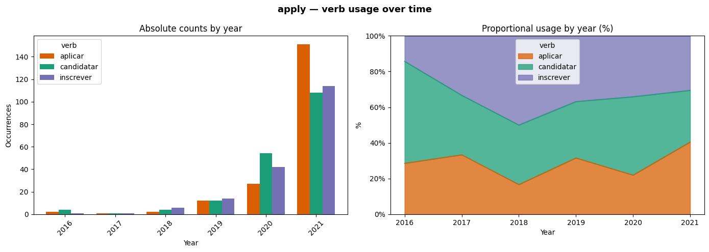
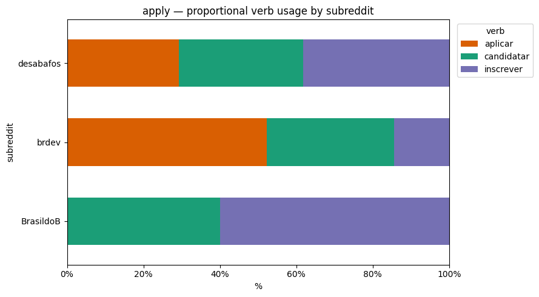
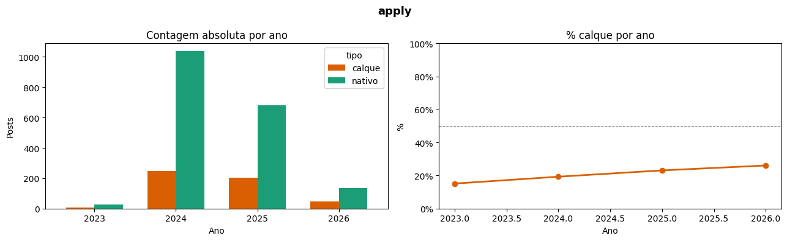
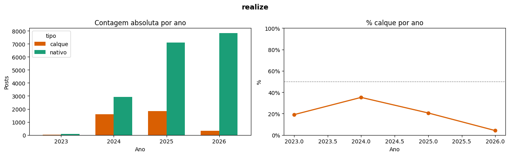

# semantic_loans

**Semantic Loans from English in Brazilian Portuguese: A Corpus Study**

This repository contains data collection scripts, annotated corpora, and analysis notebooks for a corpus-based investigation of English-induced semantic loans in Brazilian Portuguese (BP). The project focuses on cases where existing Portuguese words acquire new meanings under pressure from formally similar English cognates, displacing established native equivalents — and investigates machine translation as a likely diffusion vector for this phenomenon.

---

## Research Overview

### The phenomenon

A semantic loan occurs when an existing word in one language adopts a new meaning from a formally similar word in another language, without borrowing its phonetic form. This project investigates a specific subset: cases where BP already has a native equivalent for the target meaning, yet speakers increasingly prefer a cognate form whose extended meaning is borrowed from English.

What distinguishes these cases from classic terminology gaps is that the displacement occurs despite the existence of well-established native alternatives. *Candidatar-se* exists and is unambiguous; *aplicar* is gaining ground regardless. This suggests the mechanism is not lexical need but contact-induced preference shift — likely accelerated by the exponential growth of machine-translated content in Brazilian digital spaces.

### Central hypothesis

High-volume translation — particularly machine translation in subtitles, institutional content, and user-generated media — functions as a diffusion vector for semantic loans, accelerating their adoption beyond communities of bilingual speakers into the broader Portuguese-speaking population.

### Case studies

Two terms are studied in depth, chosen for their strong native equivalents, lexicographic evidence, and data availability:

| English source | Semantic loan (BP) | Native equivalent(s) | Existing BP meaning |
|---|---|---|---|
| *apply* (for a position) | *aplicar* | *candidatar-se*, *inscrever-se* | to place upon; to impose; to employ; to invest |
| *realize* (perceive, become aware) | *realizar* | *perceber*, *notar*, *dar-se conta* | to carry out; to execute; to make real |

Additional terms collected in the Bluesky corpus as secondary evidence:

| English source | Semantic loan (BP) | Native equivalent(s) |
|---|---|---|
| *assume* (presuppose) | *assumir* | *presumir*, *supor*, *pressupor* |
| *address* (a matter) | *endereçar* | *abordar*, *tratar* |
| *massive* | *massivo* | *enorme*, *imenso*, *gigantesco* |
| *nominee* | *nomeado* | *indicado* |
| *have an argument* | *ter um argumento* | *brigar*, *discutir* |

---

## Data Sources

The project combines three types of evidence, each serving a distinct analytical role:

**Spontaneous use corpora** track how speakers actually use these terms over time, establishing that the loans are present and growing in natural language production.

**Translation corpora** provide evidence for the diffusion vector hypothesis: if machine translation consistently produces the loan form where human translators use the native equivalent, this implicates MT as a mechanism of exposure and normalization.

### Spontaneous use: Reddit (2008–2022)

Data collected from Brazilian Portuguese subreddits via the [Arctic Shift](https://arctic-shift.photon-reddit.com) API. Queries target both loan and native forms within context-specific phrase combinations (e.g., verb + job-related term), enabling proportional analysis over time. Three communities were selected for their distinct registers and user profiles:

- **r/brdev** — software development; high incidence of professional and technical language, frequent discussion of international job markets
- **r/brasildob** — general Brazilian community with predominantly political and philosophical content
- **r/desabafos** — informal register; personal narratives and everyday life

### Spontaneous use: Bluesky (2023–2026)

Data collected via the AT Protocol API using authenticated search. The Bluesky corpus complements the Reddit data by extending the observation window into the present, allowing comparison of loan frequency before and after the widespread adoption of LLM-based translation tools. Posts are filtered using context-specific regex patterns applied after retrieval, since the Bluesky search API does not support boolean operators.

Note: the Bluesky API returns a sample of results rather than an exhaustive index. Absolute frequencies are not directly comparable across platforms; proportional analysis (calque vs. native) is the primary metric.

### Translation corpora

**OpenSubtitles** (OPUS) — high-volume subtitle translations, mixed human and machine quality. Processed via streaming TMX parser to handle large file sizes. Represents a major vector of exposure for Brazilian audiences.

**SynOPUS Wikibooks** (v1syn) — fully automatic translations generated by models trained on the Tatoeba MT Challenge dataset, without manual correction. Represents the output of MT systems directly, making it the most direct evidence for the diffusion vector hypothesis.

**COMPARA** (Linguateca) — literary translations EN↔PT-BR, produced by professional translators. Included as a normative baseline: preliminary results show that professional literary translators consistently resist loan forms, which strengthens the contrast with high-volume and automatic translation contexts.

---

## Repository Structure

```
data/
  reddit/
    raw/              # collected by date range
    curated/          # manually annotated
  bluesky/            # collected by term

notebooks/
  reddit_curation.ipynb       # Reddit curation and diachronic analysis
  bluesky_analysis.ipynb      # Bluesky proportional and diachronic analysis

scripts/
  arctic_collector.py         # Reddit data collection via Arctic Shift API
  arctic_shift_calque.py      # Reddit full-text search and classification
  bluesky_collector.py        # Bluesky data collection via AT Protocol
  calque_analyzer.py          # TMX corpus analysis (streaming, OpenSubtitles/SynOPUS)
```

---

## Methodology

### Query design

Reddit and Bluesky queries use a combination strategy: verb forms paired with context terms (e.g., *apliquei* + *vaga*, *emprego*, *job*) to retrieve only contextually relevant instances. This avoids the high false-positive rate of single-word queries while remaining robust to morphological variation. For Bluesky, API queries are short phrase pairs; post-retrieval regex filtering with lookahead windows (`verb .{0,60} context`) confirms relevance locally.

### Manual curation

Reddit data is manually curated. Each collected comment is annotated with one of four categories:

| Category | Description |
|---|---|
| `relevant` | The term is used in the target sense under investigation |
| `irrelevant` | The term is used in a different sense, outside the scope of this study |
| `ambiguous` | Context is insufficient to determine the sense |
| `excluded` | Duplicate, bot content, or unintelligible text |

Bluesky data relies primarily on regex filtering due to volume; spot-check curation is applied to verify precision.

### Primary metric

For both spontaneous use corpora, the primary metric is the **proportion of loan forms relative to native equivalents** within the same semantic context, calculated per year and per community. This controls for volume differences and makes trends comparable across platforms and time periods.

---

## Annotation Guidelines: *apply / aplicar / candidatar-se / inscrever-se*

### Target sense

The submission of an application to a job posting, internship, or formal professional selection process (*processo seletivo*). This corresponds to the English *to apply for a position*.

### Lexicographic basis

The *Dicionário Houaiss da Língua Portuguesa* lists the following senses for the three verbs:

**aplicar** — (1) to place upon, to affix; (2) to impose, to inflict; (3) to strike physically; (4) to concentrate, to direct (attention, effort); (5) to assign, to confer; (6) to employ, to make use of; (7) to devote oneself to; (8) to inject (medication); (9) to invest (capital); (10) to prescribe (medication). No acceptation covers the submission of a professional application.

**inscrever** — (1) to engrave; (2) to register, to enter one's name in a list or competition; (3) to place oneself among others of the same kind; (4) to write, to annotate. Sense 2 covers enrollment in competitions and waiting lists but does not specifically denote professional job applications.

**candidatar** — (1) to present or indicate someone as a candidate; (2) to become or declare oneself a candidate. This is the only verb whose definition directly covers the target sense.

The absence of the target sense from all Houaiss entries for *aplicar* constitutes the lexicographic evidence for the semantic loan.

### Decision criteria

**Mark as `relevant`** when the comment describes submitting an application to a job posting, trainee program, internship, or formal professional selection process, regardless of which verb is used. The criterion is functional: the described action must be equivalent to *candidatar-se*.

Relevant context markers: *vaga*, *processo seletivo*, *entrevista*, *empresa*, *LinkedIn*, *currículo*, *recrutamento*, *júnior/pleno/sênior*, *job*.

**Mark as `irrelevant`** when:
- *aplicar* is used in any Houaiss-attested sense (applying a formula, patch, fine, injection, investment, or physical force)
- *candidatar-se* refers to political candidacy
- *inscrever-se* refers to subscribing to a YouTube channel, newsletter, or online community (reflecting English *subscribe*, not *apply*)
- The comment refers to exam enrollment, non-selective course enrollment, or visa application

**Mark as `ambiguous`** when context is insufficient to determine the sense.

**Mark as `excluded`** when a previously collected data point is referenced and the verb is not independently used by the comment's author.

---

## Results

### *apply* — Reddit (r/brdev, r/brasildob, r/desabafos, 2012–2022)

Proportional usage of *aplicar*, *candidatar*, and *inscrever* varies across the studied period. The loan form *aplicar* shows a gradual increase relative to native equivalents, with notable variation across communities.



Community-level analysis reveals that lexical preferences correlate with each subreddit's thematic profile. r/brdev, which frequently discusses international job markets and software engineering roles, shows the highest incidence of the loan form — consistent with greater exposure to English professional discourse. r/brasildob, oriented toward political and philosophical topics, shows stronger preference for canonical native forms. r/desabafos, covering a broader range of everyday topics, shows the most heterogeneous distribution.



### *apply* — Bluesky (2023–2026)

The Bluesky corpus extends the observation window into the period following the widespread adoption of LLM-based tools. The loan form *aplicar* accounts for approximately 16% of occurrences in 2023, rising to 27% in 2026 — a modest but consistent increase across three years of data.



### *realize* — Bluesky (2023–2026)

*Realizar* in the cognitive sense (*realize* → *perceber*) accounts for approximately 20% of occurrences in 2023, peaking at 35% in 2024 before declining in subsequent years. The 2026 figure should be interpreted with caution as the year is incomplete at the time of collection.



### Translation corpora — preliminary

*Ongoing*

---

## Tools and Dependencies

```
pip install requests beautifulsoup4 atproto
```

Analysis notebooks run in Google Colab without additional installation. TMX corpus scripts require Python 3.10+ (standard library only). The Bluesky collector requires authenticated API access via app password.

---

## References

- Houaiss, A. & Villar, M. de S. (2001). *Dicionário Houaiss da Língua Portuguesa*. Objetiva.
- Tiedemann, J. (2020). The Tatoeba Translation Challenge — Realistic data sets for low resource and multilingual MT. *Proceedings of the Fifth Conference on Machine Translation*. https://arxiv.org/abs/2010.06354
- Arctic Shift. (n.d.). Reddit data archive and API. https://arctic-shift.photon-reddit.com
- Linguateca. (n.d.). COMPARA: Portuguese-English parallel corpus. https://www.linguateca.pt/COMPARA
- OPUS. (n.d.). Open Parallel Corpus. https://opus.nlpl.eu
